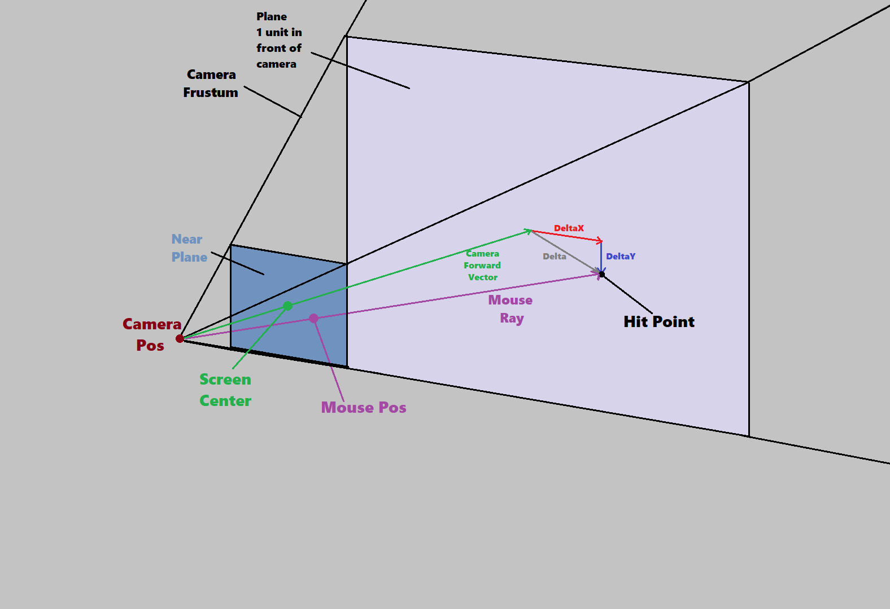
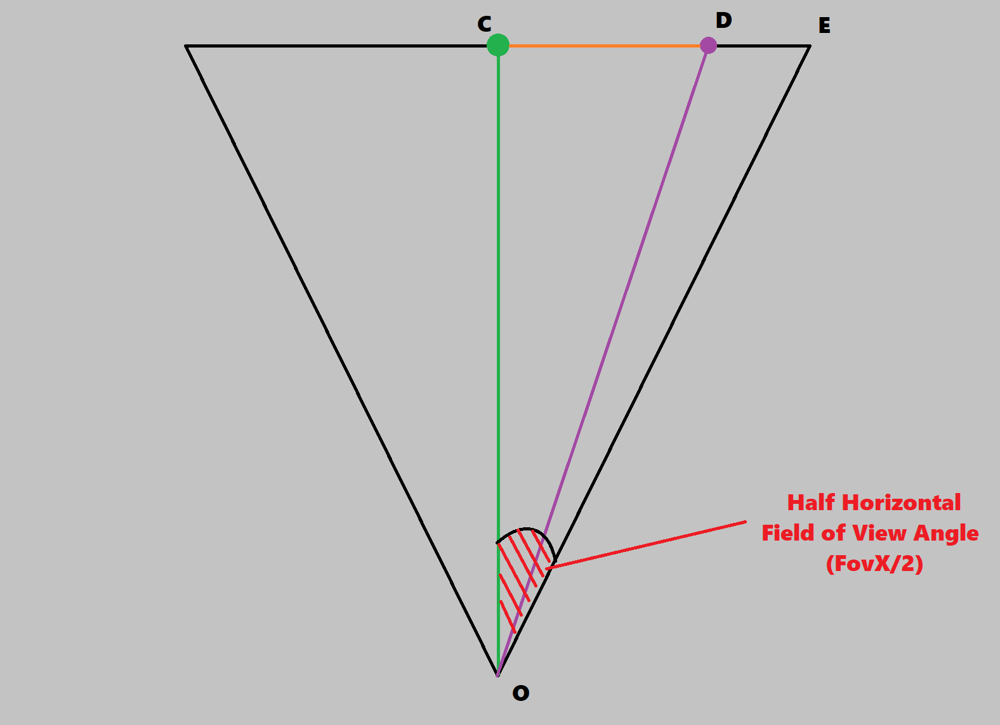

# Mouse Raycasting Derivation
## 18th August 2026

> **Summary**: This article outlines a derivation for a simple way to cast a ray in world space through a mouse position on the screen, allowing for mouse picking, shooting gameplay, etc.

I read an interesting blog post outlining a very simple way to cast a ray through a given mouse position in screen space: [Mouse Raycasting by Diego Sainz-Pardo Laso](https://themadmanshill.com/posts/02-mouse-raycasting/mouse-ray.html). This is a very short and convenient formula compared to the mentioned alternative method of transforming a ray in projection space to world space using many matrix multiplications. The author didn't make it clear how to derive the new method used so I figured it out and will share it here.

First, a diagram of the problem - for a given position on the screen (`Mouse Pos`) we want to construct a ray (`Mouse Ray`) the starts at the camera position and passes through the equivalent position on the near plane of the camera frustum:



Consider the `Camera Forward Vector` - this is a unit vector travelling from the camera position (`Camera Pos`) through the center of the frustum. At the end of this vector we construct a plane that is aligned with the near plane. Let's call the point at which `Mouse Ray` hits this plane `Hit Point`. The vector from `Camera Pos` to `Hit Point` can be expressed as `Camera Forward Vector` plus some unknown vector `Delta` that lies on the plane. If we can calculate `Delta` we can construct this vector and normalise it to get our `Mouse Ray`.

To solve this problem we split `Delta` into a horizontal and vertical component (`DeltaX` and `DeltaY`, which are parallel to the camera's Right and Up vector respectively). We can derive a formula for each of these values. First, let's draw the scene from the top down to help find `DeltaX`:


Triangles OAB and OCD are right-triangles sharing an angle therefore their sides are in the same ratio: `AB/OA == CD/OC`

`OA` is 1 (the length of the camera's forward vector) and can be removed from the equation. `OC` is the distance of the frustum's near plane from the camera (specified when calculating the perspective projection matrix) which we will call `nearZ`. `AB` is our unknown `DeltaX` so all that remains is to calculate `CD`. Here's a diagram showing only that part of the problem:



We already have some information about the length of `CD` - the mouse position is usually given in normalised device coordinates (we'll call this value `MousePosNDC`), which go from -1 to 1 on the x- and y-axis irrespective of screen dimensions. This means we have a value of `CD` expressed as a fraction of `CE`, half the width of the frustum's near plane. We know the angle between `OC` and `OE`, it's half the camera's horizontal field of view so we can calculate `CE` and express `CD` (or `DeltaX` from the first diagram) in those terms:

```
tan(FovX/2) = CE/OC
=> CE = tan(FovX/2)

CD = MousePosNDC.x * CE
=> DeltaX = MousePosNDC.x * tan(FovX/2)
```

We can do the same derivation for `DeltaY` by looking at the problem from the side and using the same trigonometry:


Following the same procedure as before we can derive `DeltaY`. The two calculations are therefore:
```
DeltaX = MousePosNDC.x * tan(FovX/2)
DeltaY = MousePosNDC.y * tan(FovY/2)
```

Note that we have two different field of view angles here - in graphics programming we only ever define one and express the other with the relationship:

```
FovX = FovY / AspectRatio
```

where `AspectRatio` is `ViewportWidth/ViewportHeight`. People often use `FovY` (because historically that's what old graphics APIs expected when you configured the fixed function pipeline) but if you want the field of view to be adjustable by users/designers it's better to use the much more intuitive `FovX` and convert, but either will work.

```
FovY = FovX * AspectRatio
```

Finally here's the pseudocode for the full process. Note that this function works for any point on the screen (not necessarily the mouse position) so I call the point `ndcPos` instead of `mousePos`. Thanks again to Diego for the original blog post.

```cpp
struct Ray
{
    vec3 origin;
    vec3 dir;
    float length;
};

Ray getRayThroughScreenPos(
    vec2 ndcPos, // Position on screen in NDC (-1 -> 1)
    vec3 camPos, // Position of camera in world space
    vec3 camFwd, // Forward vector of camera
    vec3 camUp,  // Up vector of camera
    vec3 camRight, // Right vector of camera
    float fovX,   // Horizontal field of view of camera (in Radians)
    float aspectRatio
    )
{
    float tanHalfFov = tanf(0.5f * fovX);
    vec3 deltaX = camRight * tanHalfFov * ndcPos.x;
    vec3 deltaY = camUp * (tanHalfFov / aspectRatio) * ndcPos.y;
    Ray ray;
    ray.origin = camPos;
    ray.dir = normalise(camFwd + deltaX + deltaY);
    ray.length = 1.f;
    return ray;
}

```