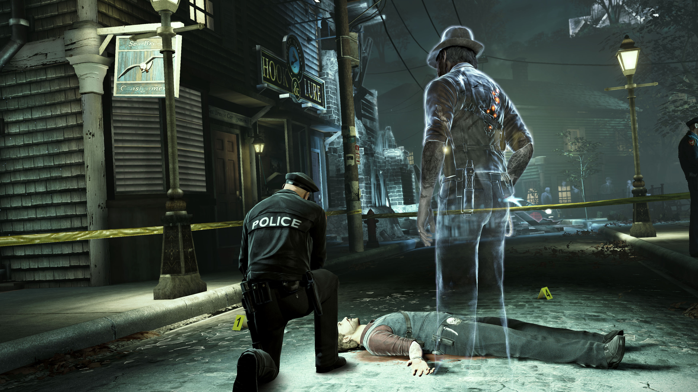
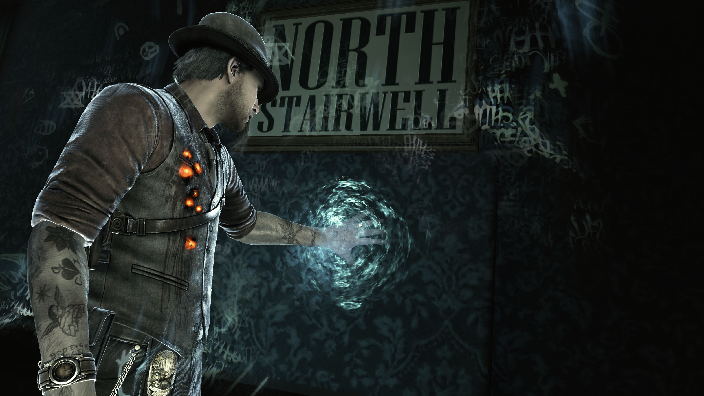

# Thoughts on Murdered: Soul Suspect, 10 Years On
## 5th February 2024

I remember seeing a trailer or something for Murdered: Soul Suspect back around 2014 —a game where you’re a detective who gets thrown out a window, stands up as a ghost and has to solve his own murder — and thinking, “that looks cool”. Recently, Ed Smith mentioned the game during the recent [Bullet Points Podcast episode on Robocop: Rogue City](https://www.bulletpointspodcast.com/post/740500500208861184/episode-93-robocop-rogue-city).

> “…some of the best games are also the games that get like 6 out of 10 on you know like an IGN or something. I always go back to Murdered: Soul Suspect which got, like, the lukest, warmest of lukewarm reviews, but I think actually had something quite special in there”

I was intrigued, so decided to take it for a spin. To no-one’s surprise, it’s ok! I still love the core conceit — if you had a good writer to punch things up this could be great schlocky genre trash. The bit in [the intro](https://www.youtube.com/watch?v=rWdcNo22J0I) where scenes from Detective Ronan O’Connor’s life flash before his eyes as the associated tattoos appear on his body is inspired — assuming this team didn’t steal that from some movie I’ve never seen, somebody should steal it from them! I think this sequence is indicative of the writers’ desire for their lead to have an actual history; this is a ghost story, and these quick flashbacks get fleshed out in vignettes of Ronan's life you can find throughout the game. In contrast, finding the stilted exposition notes inexplicably written by his dead wife Julia reminds you that this is a mid 2010s video game.

One thing I didn’t know going in was that the story is set in Salem, Massachusetts, and the plot is entwined with the town’s history with witch trials. As the game progresses you realise that the serial killer you’re chasing has been killing young women using puritan-era torture methods associated with punishing witches. In true videogames fashion, it takes the experienced detective you’re playing as another hour or so to put this together. The game pulls no punches here — you’re shown grisly flashbacks of these murders, and even more upsettingly meet two of the victims’ ghosts — one gaunt and bloated from drowning, the other charred and smouldering after being burnt at the stake. On a fundamental level this hits hard, but I’m not sure the game manages to say anything deeper with it. I can maybe admire the tenacity with which it portrays real historic atrocities but it feels more to me that the game knows it can get a strong reaction with depictions of helpless women subjected to extreme cruelty, similar to some of the more leering murder scenes in 2011's L.A. Noire.

I thought playing as Cole Phelps, the bumbling, shopping trolley of a detective was tough, but the investigation sequences of Murdered sink to new lows of pixel hunting misery. Thanks to the power of the PS3 you have scenes cluttered with enough detail that the important objects are not always apparent, and there’s no Eagle Vision to bail you out. This reduced a lot of the game to dutiful lawn mowing for me, trying to check every square inch for a Square Button prompt. 

While trawling for clues is mostly rote it marries surprisingly well with my favourite aspect of the game’s design. As a ghost you can walk through most walls and objects[1], so every room in a building becomes interconnected. I’m usually pretty good at mapping out 3D spaces in my head, but when you’re not funnelled along corridors and through doorways any mental map quickly becomes a labyrinth. The level design of interior spaces can be wonderfully weird, like the apartment building at the start of the game; you need to make it to your murder scene on the top floor, but instead of a stairwell with access to every storey you have this bizarre, videogamey architecture of separate stairwells on opposite corners of the building with corridors snaking through apartments between them. Walking through walls to comb for collectibles, I kept emerging in strange backrooms or unexpectedly stumbling into a room I’d already been in, which was a cool kind of surprise I don’t think I’ve ever felt before. It was a rare moment of harmony between the experience of the newly deceased detective and that of the player.

Unfortunately, the narrative elements that punctuate this exploration were usually a bit crap. In said apartment building, I found a ghost who told me she’d been murdered and couldn’t find her body. Her soul couldn’t find peace until I solved this mystery, so I went into an adjacent apartment to investigate the elderly residents. One of your ghostly powers is Influence— while possessing certain NPCs you can choose from a selection of gathered evidence to bring something to their mind and gain new information. I chose the murdered girl from the list, causing the elderly woman to think to herself “I sure am glad we murdered that girl next door for playing her music too loud!” 

The detective work of the game never amounts to much more. Your companion throughout the game is Joy, a teenage medium who is being hunted by the killer. The dadgame energy is nothing special in this one; Ronan and Joy’s relationship isn’t given much room to grow, and the gameplay aspects of being a ghost with a corporeal companion feel undercooked. Otherwise you have some mercifully perfunctory stealth segments, a smattering of brainless puzzle-solving and most surprisingly a few sequences where you possess cats to climb around/skulk through air vents. It only feels slightly worse than playing Stray, and no more tedious! 

While I was usually a few steps ahead of the plot, the ending did have a few surprise twists that I didn’t see coming, but I can’t say it'll stick with me beyond that initial "gotcha" moment. The gameplay truly has nowhere to go for the climax, you walk up to the villain and press Square, then sit back for the final cutscenes. While the game occasionally gestures at themes of justice or the cyclical nature of violence, by the end it feels like the money is running out and they just have to get this one out the door. Ronan narrates the tepid final scenes with one of his storebrand hardboiled detective monologues before walking offscreen to be reunited with his lost love and cross over to the other side without us. 6 out of 10.

***

[1] In the physical world. Salem contains ghostly remains of old buildings and fixtures which block you. This is mostly a level design trick to wall off areas, but the fact that living characters are often strolling obliviously through spectral burning ruins is a fun, if underexplored, visual metaphor.
