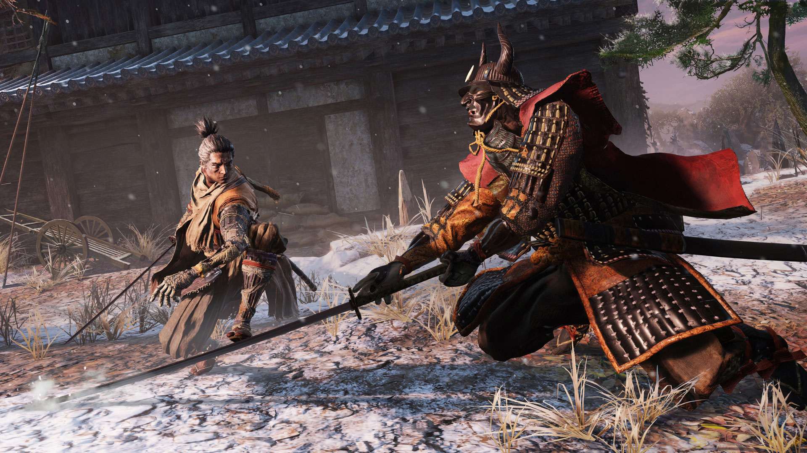

# Put SlowMo in Every Action Game
## 13th May 2021

I want games to be accessible and inviting to as many people as possible. Great strides are being made to improve accessibility in games, and additions like these can make a big difference to players with disabilities, newer inexperienced players, older players with slower reaction times, or even just players who don't have the space in their lives for games that take dozens of hours to complete.

While every player is different and I'm in favour of games including as wide a set of accessibility options as possible, the one addition that I think should be in literally every action game is a button to toggle the game running in slow motion.

Rather than simplifying games by removing or negating mechanics, e.g. giving the player invincibility or infinite ammo (although I have no problem with these options being available too), it focuses on the main potential difficulty, which is precise timing. Being able to widen the window in which they can react would be a huge benefit to players struggling with high-tempo action games such as Sekiro.

This means that they are training themselves to perform the actions the game is asking of them, but in a more forgiving way. In the same way that musicians learn to play slowly, this is a much more effective way to train than having to try and fail at a challenge that's too far beyond you. To paraphrase a karate teacher of mine, you learn almost nothing by getting beat up by a better fighter.

Because slowing down time naturally impedes your progress, I think it incentivises players to use it sparingly with a goal of getting "up to speed". In this way it becomes a player-controlled tutorial, a teaching aid that they can discard when they are comfortable without it. I think this would lead to a huge explosion in player skill levels in general if games gave them a staircase to mastery instead of putting up a brick wall and asking them to sink dozens of hours running back to boss fights to attempt for a minute before dying again.

Additionally, this feature would be a fantastic avenue for player expression. I'm a huge believer in "games as performance", playing a game specifically to entertain an audience (e.g. by purposely walking slowly for dramatic effect). Being able to slow down time at key moments would empower players to be cinematographers, highlighting key moments for dramatic effect. This could actually be a way for players to add *more* challenge to the game, since being able to predictively or reactively slow down time at a key moment is a skill in itself.

When Sekiro came out, Twitter user SunHiLegend went viral with [stunning gameplay gifs](https://twitter.com/i/events/1112675432434929664) using cinematic speed-ramping. Photo modes in games have seen an explosion in popularity, and social media presence is now more than ever a key marketing strategy for games. I think it's a no-brainer to allow players to make gameplay look more exciting and cinematic for sharing with their audiences.

Finally, there is the technical advantage that this should be a simple addition for most games, since it just requires scaling the simulation's delta time. Most games or engines already have this feature for debugging purposes, the main potential difficulty is having a button to spare on gamepads. This is to my mind the accessibility/approachability feature that will give developers the most bang for their buck, and I would love to see it become an industry standard.